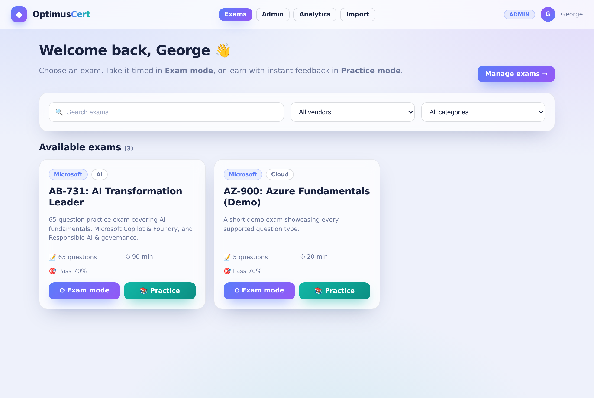
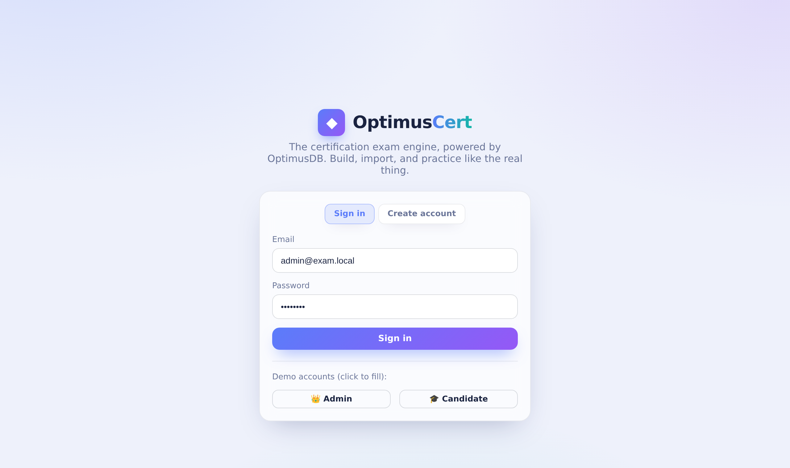
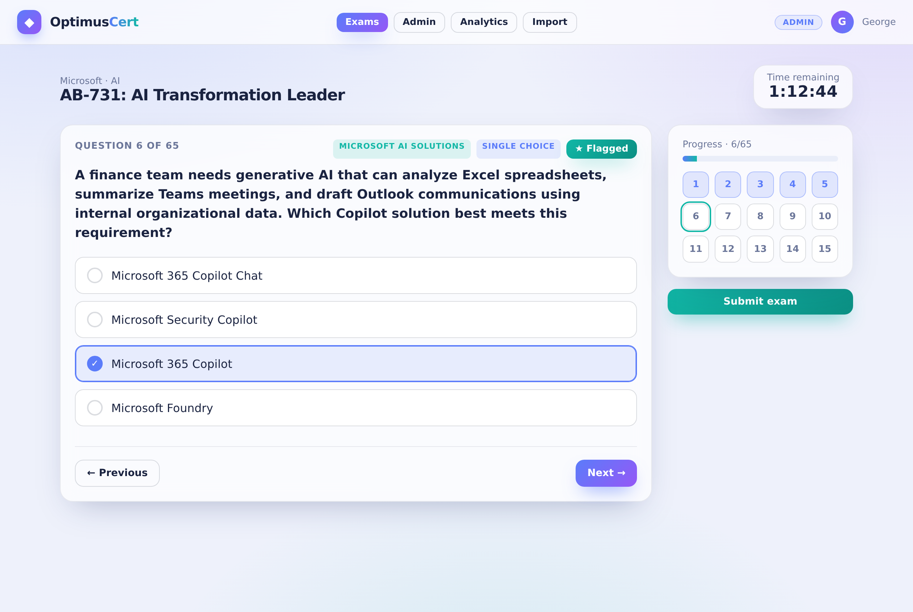
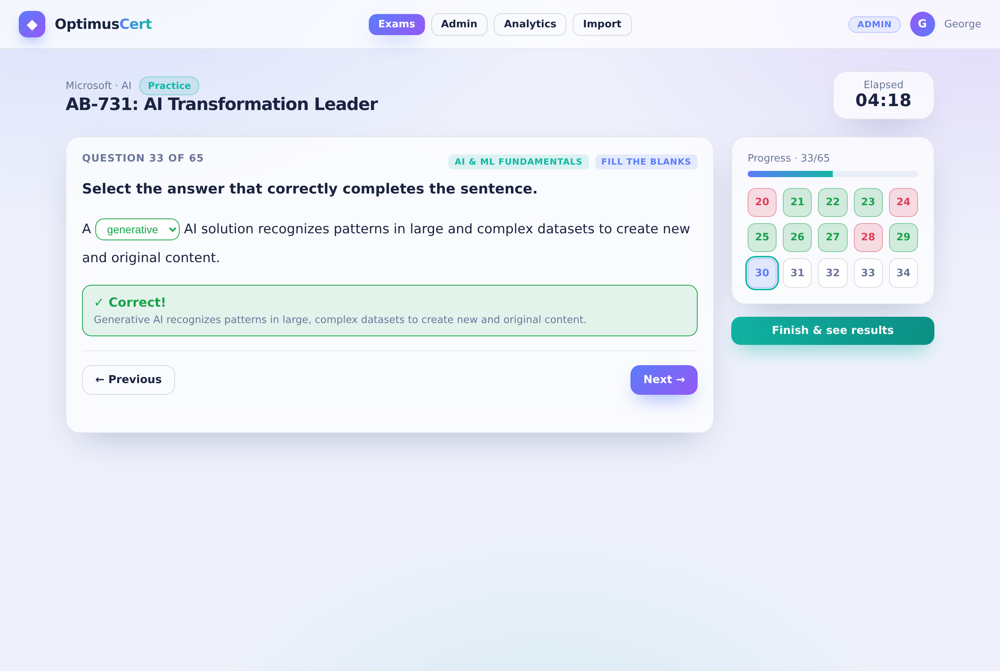
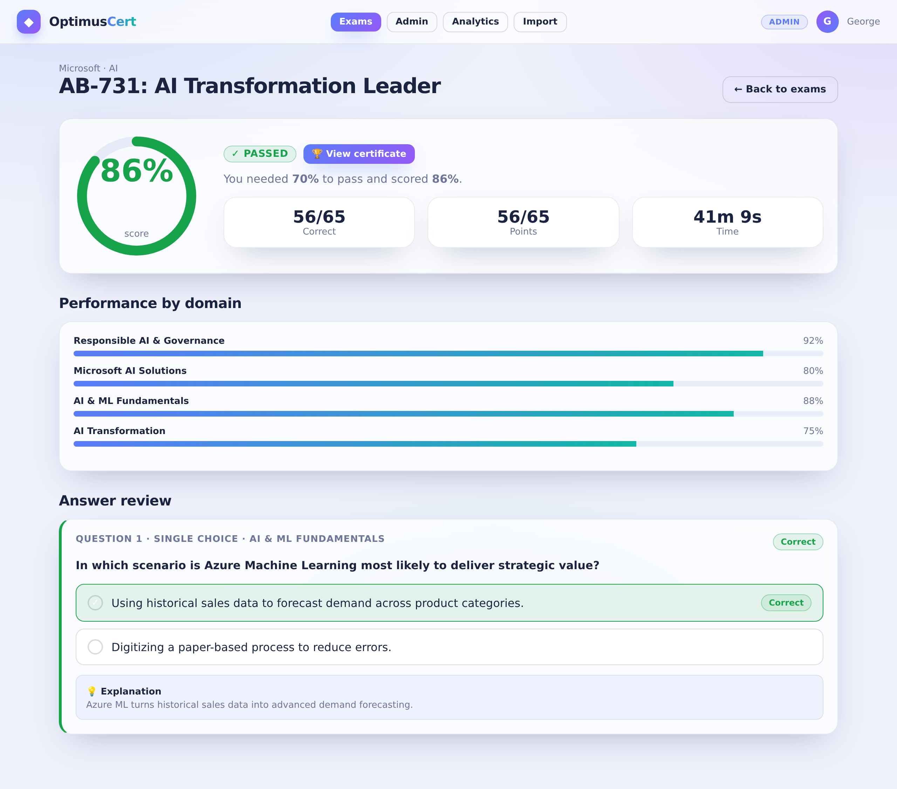
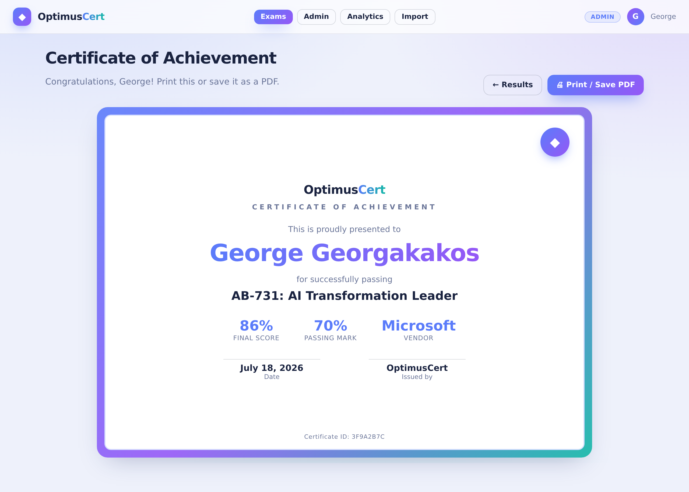
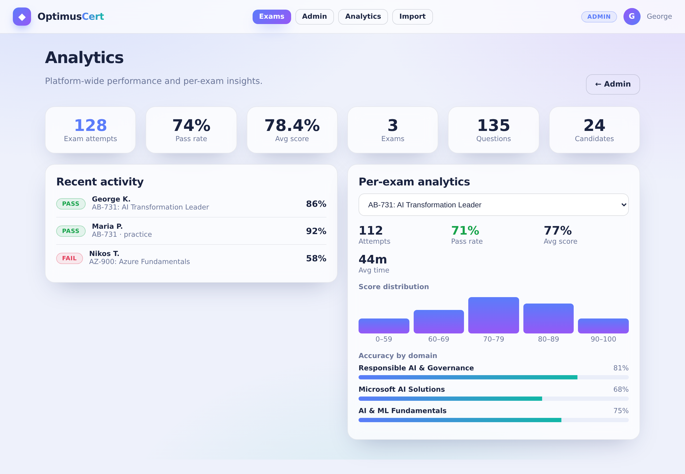
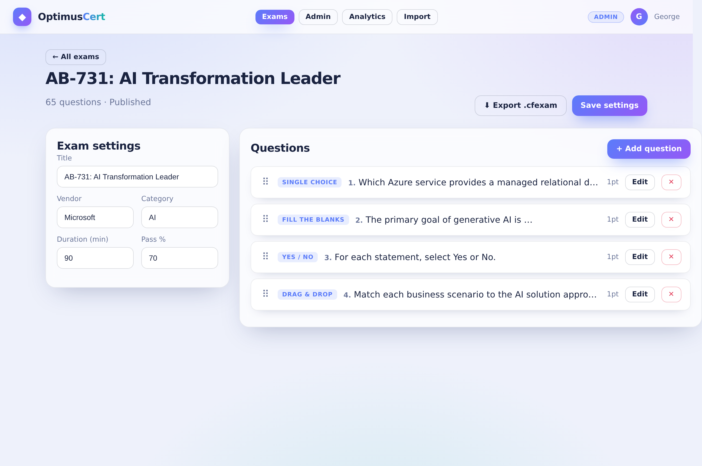
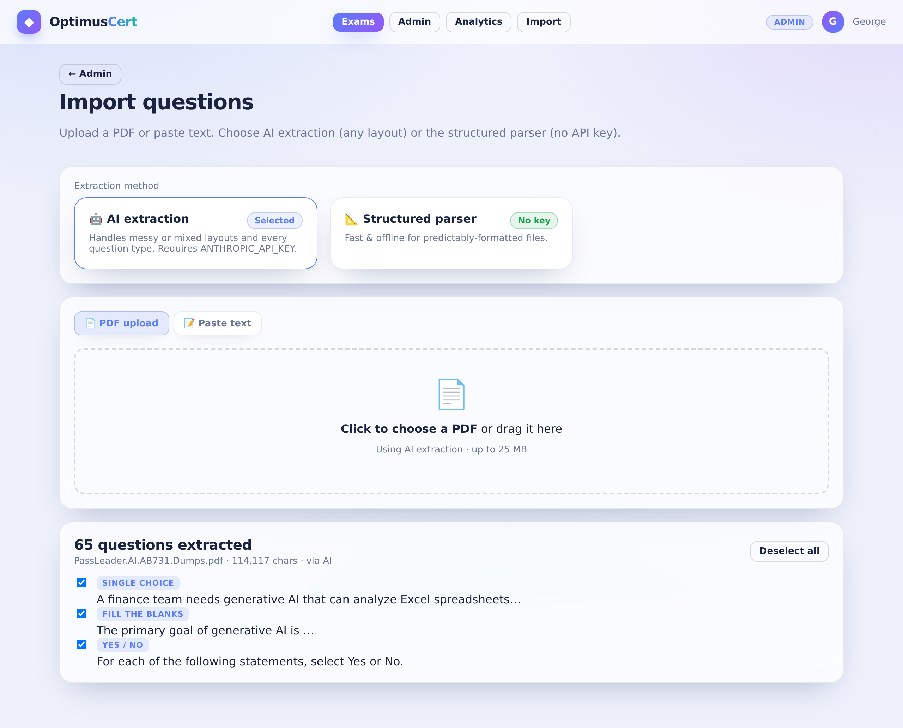

# ◆ OptimusCert

**A fancy, light-themed certification exam platform — powered by the OptimusDB engine.**

OptimusCert is a Microsoft-exam-style test platform with a timed **Exam mode**, a **Practice mode** with instant feedback, an admin studio to build exams (drag-and-drop builder), AI **and** rule-based PDF import, an analytics dashboard, printable certificates, and a portable `.cfexam` file format. It ships as two Docker containers — one `docker compose up` and it runs.


> **Built on OptimusDB research.** OptimusCert is the applied result of research into **OptimusDB**, a small purpose-built data + assessment engine for testing platforms. See [About OptimusDB](#-about-optimusdb-the-engine) below.



---

## 📸 Screens at a glance

| | |
|---|---|
|  |  |
| **Sign in** — light, glassy auth with demo accounts | **Exam mode** — timed, flagging, question navigator |
|  |  |
| **Practice mode** — instant per-question feedback | **Results** — score ring + per-domain breakdown |
|  |  |
| **Certificate** — printable / save-as-PDF on pass | **Analytics** — pass rate, distribution, hardest Qs |
|  |  |
| **Admin builder** — drag-and-drop question authoring | **Import** — AI or no-key structured parser |

> The images above are UI mock-ups rendered from the app’s real stylesheet; the running app looks the same.

---

## ✨ Highlights

**For candidates**
- **Exam mode** — timed, scored, auto-submit on timeout, question navigator, flagging.
- **Practice/Study mode** — check each answer as you go with instant feedback and explanations.
- Result screen with a pass/fail **score ring**, **per-domain performance**, and full answer review.
- A printable **Certificate of Achievement** on every pass (save as PDF from the browser).
- Catalog **search & filters** (by vendor / category).

**For admins**
- Create / edit / publish exams; **drag-and-drop question builder** with a template per type.
- **Import questions** from a PDF two ways: **AI extraction** (any layout, needs a key) or the **structured parser** (no key, for predictable dumps).
- **Analytics dashboard** — pass rate, average score, score distribution, accuracy by domain, and the hardest questions per exam.
- **`.cfexam`** export/import to back up, move, or share whole exams.

**Question types (all Microsoft-style):** single choice · multiple choice · drag-and-drop matching · Yes/No hotspot grids · fill-the-blank dropdowns.

---

## 🚀 Quick start (Docker Desktop)

```bash
cp .env.example .env          # then paste a random JWT_SECRET; add ANTHROPIC_API_KEY only if you want AI import
docker compose up --build
```

Open **http://localhost:8080** and sign in:

| Role      | Email              | Password   |
|-----------|--------------------|------------|
| Admin     | `admin@exam.local` | `admin123` |
| Candidate | `user@exam.local`  | `user123`  |

Stop with `Ctrl+C`, then `docker compose down` (`-v` also wipes the data volume).

---

## 🧠 About OptimusDB (the engine)

**OptimusDB** is the data + assessment engine behind OptimusCert, and this project is the applied result of that research. Rather than bolt a generic ORM onto the app, the engine is a small, purpose-built layer that owns the three things a certification platform actually needs.

1. **A typed question model.** Every question — regardless of type — is stored as a compact JSON document (`data`) alongside a `type`, `domain`, and `points`. The engine defines exactly one canonical shape per type (single, multi, dragdrop, hotspot, dropdown), which keeps the builder, the grader, the importer, and the `.cfexam` format all speaking the same language.
2. **A deterministic grading core.** Grading is pure and centralized in `services/grading.js`: given a question document and a response, it returns a verdict. The same function powers timed submission, practice-mode single-question checks, and analytics — so a score can never disagree with itself.
3. **Attempt analytics.** Each attempt persists a per-question `detail` record, which the analytics layer rolls up into pass rates, score distributions, per-domain accuracy, and hardest-question rankings without extra bookkeeping.

Under the hood OptimusDB persists to an embedded **SQLite** database (via `better-sqlite3`) stored in a Docker volume, so it is zero-config and file-portable — but the app only ever talks to the engine’s API, so the storage substrate is an implementation detail.

```
┌────────────┐    /api/*     ┌─────────────────────┐
│ OptimusCert│ ─────────────▶│  OptimusDB engine   │
│  React SPA │  (nginx proxy)│  Node/Express API   │
│  nginx :80 │               │  grading · analytics│
└────────────┘               └──────────┬──────────┘
   :8080 host                           │ embedded
                                   ┌─────▼─────┐
                                   │  SQLite   │  (docker volume: exam-data)
                                   └───────────┘
```

---

## 📚 Exam vs Practice mode


- **Exam mode** runs a countdown from the exam’s duration and auto-submits when time expires. Answers stay hidden until you finish.
- **Practice mode** is untimed (it shows elapsed time). A **Check answer** button reveals whether each answer is correct, highlights the right answer, and shows the explanation — and the navigator turns green/red as you go.

Both use the identical OptimusDB grading core, so practice results and exam results are consistent.

---

## 📄 Importing questions


On **Admin → Import**, pick a method:

- **🤖 AI extraction** — handles messy/mixed layouts and every question type. Requires `ANTHROPIC_API_KEY` in `.env`.
- **📐 Structured parser** — no key needed; for files that follow the common dump layout (numbered questions, `A`–`D` options, an `Answer:` line). Two+ answer letters become multiple-choice automatically. The exact format is shown in the UI.

You review and pick which extracted questions to keep before saving into a new or existing exam.

> The bundled **AB-731** exam was produced with this pipeline: 50 of 65 questions parsed straight from the PDF text, and the 15 image-based hotspot/drag questions reconstructed and verified. All 65 grade correctly.

---

## 📊 Analytics & 🏆 certificates


Admins get a live analytics dashboard: platform totals, recent activity, and per-exam pass rate, average score, score distribution, accuracy by domain, and the hardest questions. Every candidate who passes can open and print a **Certificate of Achievement**:


---

## 💾 The `.cfexam` file format

Any exam exports to a single portable file (**Admin → Export .cfexam**) and re-imports on another install (**Import .cfexam**). It’s readable JSON under the `optimuscert-exam` schema (older `certforge-exam` files are still accepted). A copy of the AB-731 exam ships as `AB-731_AI_Transformation_Leader.cfexam`.

---

## 🛠 Local development (without Docker)

```bash
# OptimusDB API
cd backend && npm install
ANTHROPIC_API_KEY=sk-ant-... npm run dev        # http://localhost:4000

# Web app
cd frontend && npm install
npm run dev                                      # http://localhost:5173 (proxies /api → :4000)
```

---

## 🔌 Key API routes

| Method | Route | Purpose |
|--------|-------|---------|
| POST | `/api/auth/login`, `/api/auth/register` | Auth (admin / candidate) |
| GET/POST/PUT/DELETE | `/api/exams` … `/api/questions/:id` | Exam & question CRUD |
| POST | `/api/attempts` (`mode: exam \| practice`) | Start an attempt |
| POST | `/api/attempts/:id/check` | Practice — check one question |
| POST | `/api/attempts/:id/submit` | Submit & grade |
| GET | `/api/analytics/overview`, `/api/analytics/exam/:id` | Admin analytics |
| POST | `/api/import/pdf` \| `/api/import/text` (`method: ai \| structured`) | Import |
| GET/POST | `/api/exams/:id/export`, `/api/exams/import-file` | `.cfexam` round-trip |

---

## 🗂 Project structure

```
optimuscert/
├── docker-compose.yml
├── README.md
├── docs/screenshots/           # the mock-up images in this README
├── backend/                    # OptimusDB engine (Node/Express + SQLite)
│   └── src/
│       ├── services/grading.js # deterministic grading core
│       ├── routes/             # auth, exams, questions, attempts, import, analytics
│       └── seeds/ab731.json    # the pre-loaded AB-731 exam
└── frontend/                   # React + Vite SPA (served by nginx)
    └── src/{pages,components,styles}
```

---

## 🔒 Notes
- Change `JWT_SECRET` and `ADMIN_PASSWORD` before any real deployment.
- Login sessions are in memory, so a browser refresh signs you out (expected for this build).
- The bundled dump is third-party study material included for demonstration; verify answers against official Microsoft documentation.
- Grading is all-or-nothing per question; partial-credit hooks live in `backend/src/services/grading.js`.
